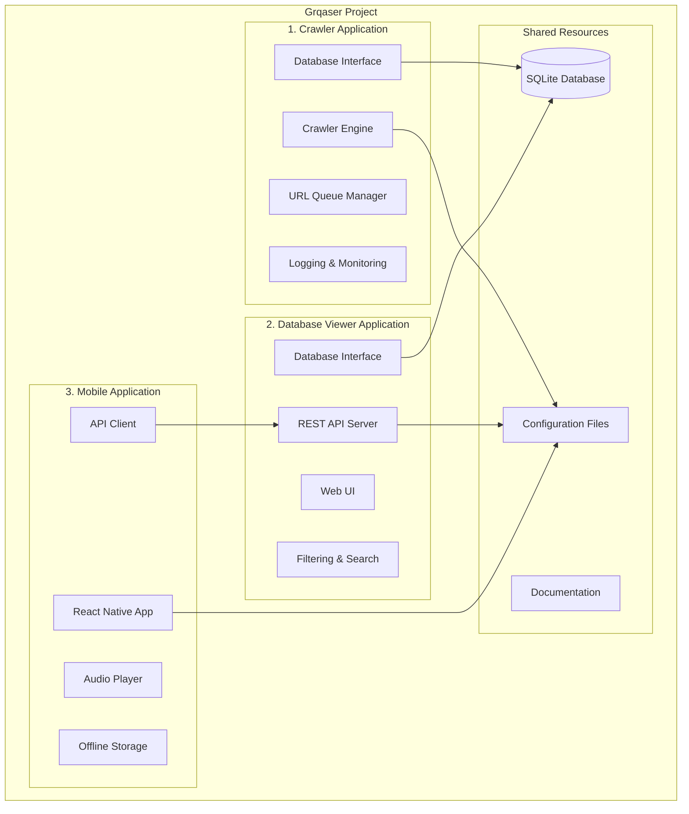
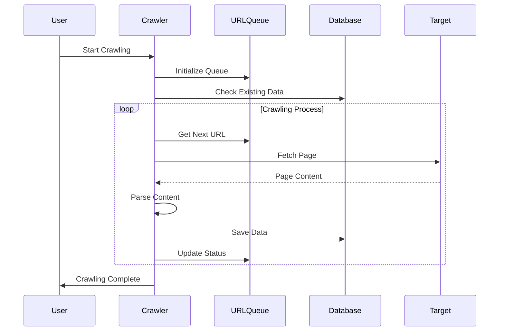
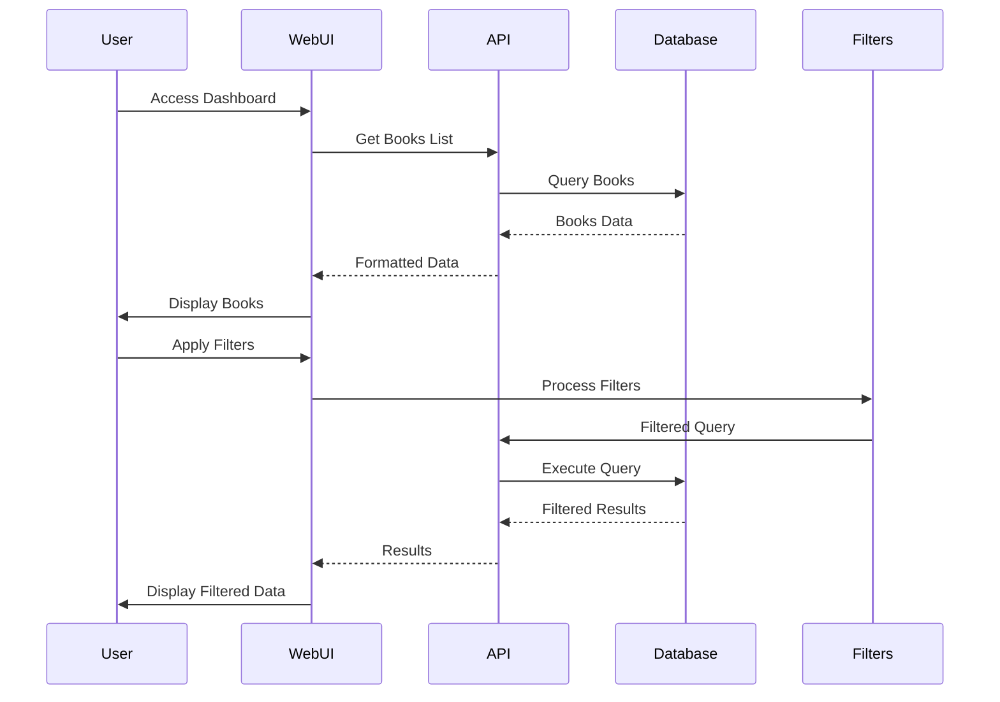
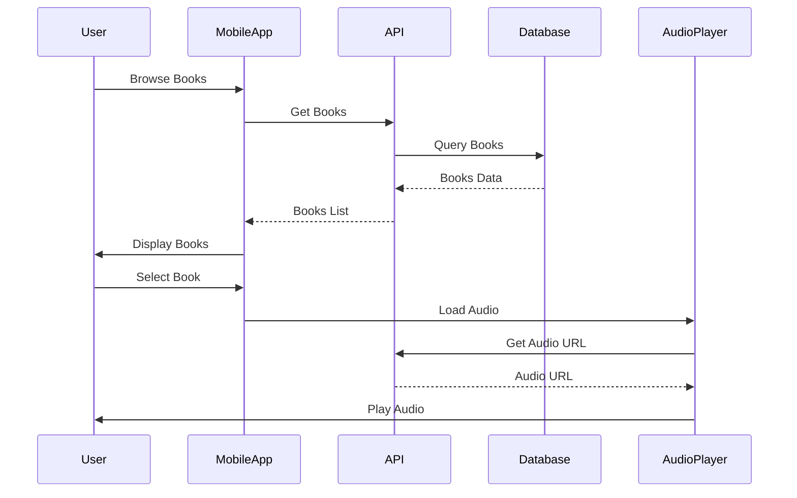

# App Development Cleanup and Restructuring Architecture

## Overview
This document outlines the proposed architecture for restructuring the Grqaser project into three independent applications with clean separation of concerns.

## System Architecture



## Application 1: Crawler Application

### Architecture


### Components
- **Crawler Engine**: Main crawling logic with Puppeteer
- **URL Queue Manager**: Manages URL processing queue
- **Database Interface**: SQLite operations
- **Configuration Manager**: Settings and environment management
- **Logging System**: Comprehensive logging and monitoring
- **Error Handler**: Robust error handling and recovery

### Key Features
- Single, robust crawler implementation
- Comprehensive error handling and retry logic
- Real-time status monitoring
- Configurable crawling parameters
- Database transaction management

## Application 2: Database Viewer Application

### Technology Choice: Node.js with Express

**Rationale**: 
- Consistent with existing crawler technology
- Faster development for web UI
- Better integration with existing Node.js ecosystem
- Simpler deployment and maintenance

### Architecture


### Components
- **REST API Server**: Express.js backend
- **Web UI**: React-based frontend
- **Database Interface**: SQLite operations
- **Filtering Engine**: Advanced search and filtering
- **Real-time Updates**: WebSocket for live data
- **Export Functionality**: Data export capabilities

### Key Features
- Real-time book data visualization
- Advanced filtering by author, category, duration
- Crawler status monitoring
- URL processing details
- Error tracking and reporting
- Data export capabilities

## Application 3: Mobile Application

### Architecture


### Components
- **React Native App**: Cross-platform mobile application
- **API Client**: Communication with backend
- **Audio Player**: Audio streaming and playback
- **Offline Storage**: Local data caching
- **Navigation**: App navigation and routing

## Database Schema

### Current Tables
1. **books**: Main audiobook information
2. **chapters**: Individual chapter data
3. **authors**: Author information
4. **categories**: Category information
5. **book_authors**: Many-to-many relationship
6. **url_queue**: Crawler URL management

### Proposed Enhancements
- Add **crawl_logs** table for detailed logging
- Add **api_requests** table for API monitoring
- Add **user_sessions** table for mobile app tracking

## Configuration Management

### Environment Configuration
```javascript
// config/environment.js
module.exports = {
  development: {
    database: './data/grqaser.db',
    apiPort: 3001,
    crawlerDelay: 2000,
    maxRetries: 3
  },
  production: {
    database: '/var/data/grqaser.db',
    apiPort: process.env.PORT || 3001,
    crawlerDelay: 5000,
    maxRetries: 5
  }
};
```

### Application Configuration
- **Crawler**: Crawling parameters, timeouts, retry logic
- **Database Viewer**: API settings, UI preferences, export options
- **Mobile App**: API endpoints, audio settings, offline configuration

## Security Considerations

### API Security
- Input validation and sanitization
- Rate limiting for API endpoints
- CORS configuration for web UI
- Authentication for sensitive operations

### Data Security
- Database access controls
- Sensitive data encryption
- Audit logging for data changes
- Backup and recovery procedures

## Deployment Strategy

### Development Environment
- Local development with hot reloading
- Shared SQLite database
- Development configuration profiles

### Production Environment
- Containerized applications (Docker)
- Separate database instances
- Load balancing for API
- Monitoring and logging infrastructure

## Monitoring and Logging

### Application Monitoring
- Health check endpoints
- Performance metrics collection
- Error tracking and alerting
- Usage analytics

### Logging Strategy
- Structured logging (JSON format)
- Log levels (DEBUG, INFO, WARN, ERROR)
- Centralized log aggregation
- Log rotation and retention

## Testing Strategy

### Unit Testing
- Individual component testing
- Mock database and external services
- Automated test suites

### Integration Testing
- API endpoint testing
- Database integration testing
- End-to-end workflow testing

### Performance Testing
- Load testing for API endpoints
- Crawler performance benchmarking
- Database query optimization

## Migration Plan

### Phase 1: Preparation
- Backup existing data and code
- Create new project structure
- Set up development environment

### Phase 2: Crawler Consolidation
- Analyze existing crawlers
- Implement single crawler
- Test and validate functionality

### Phase 3: Database Viewer Development
- Implement REST API
- Create web UI
- Add filtering and search

### Phase 4: Integration and Testing
- Test all applications together
- Performance optimization
- Documentation completion

### Phase 5: Deployment
- Production environment setup
- Data migration
- Monitoring implementation
